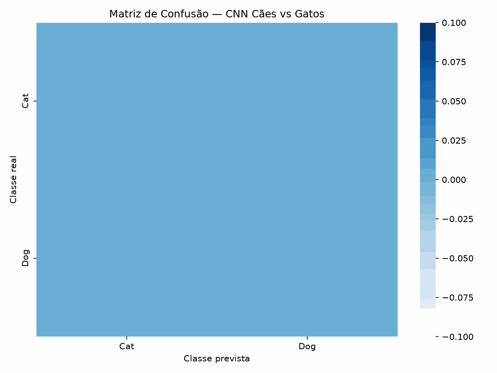

# 🐶🐱 CNN Cão e Gato — Computer Vision


Projeto de **Visão Computacional** desenvolvido em Python utilizando uma **Rede Neural Convolucional (CNN)** para classificação de imagens entre as classes **cão** e **gato**.

O projeto foi desenvolvido durante os estudos de **Machine Learning e Visão Computacional**, com foco na construção, treinamento e avaliação de uma CNN utilizando **TensorFlow/Keras**.

## 🎯 Objetivo

Desenvolver um modelo de classificação capaz de analisar imagens e identificar se elas pertencem à classe:

* 🐱 **Cat**
* 🐶 **Dog**

O projeto aborda desde o carregamento e preparação das imagens até o treinamento, avaliação e visualização dos resultados do modelo.

## 🛠️ Tecnologias utilizadas

* 🐍 Python
* 🧠 TensorFlow
* 🧩 Keras
* 👁️ Computer Vision
* 🔢 NumPy
* 📊 Matplotlib
* 📈 Seaborn
* 🤖 Machine Learning
* 📓 Jupyter Notebook
* 🔧 Git e GitHub

## 📂 Estrutura do projeto

```text
CNN_Cao_Gato_Computer_Vision/
│
├── dogs_vs_cats/
│   ├── train/
│   │   ├── cat/
│   │   └── dog/
│   │
│   ├── val/
│   │   ├── cat/
│   │   └── dog/
│   │
│   └── test/
│
├── resultados/
│   ├── graficos/
│   ├── matrizes_confusao/
│   └── previsoes/
│
├── modelos/
│
├── cnn_cao_gato.ipynb
├── README.md
├── .gitignore
└── .python-version
```

> O dataset e o modelo treinado não são versionados no GitHub devido ao tamanho dos arquivos.

## 🧠 Arquitetura da CNN

A rede neural foi construída utilizando `Sequential` do Keras.

Principais etapas da arquitetura:

```text
Entrada: 256 × 256 × 3
        ↓
Data Augmentation
        ↓
Rescaling
        ↓
Conv2D - 32 filtros
        ↓
MaxPooling2D
        ↓
Conv2D - 64 filtros
        ↓
MaxPooling2D
        ↓
Flatten
        ↓
Dense - 128 neurônios
        ↓
Dropout - 20%
        ↓
Dense - 1 neurônio
        ↓
Sigmoid
```

A camada de saída possui **apenas um neurônio**, utilizando a função de ativação `sigmoid`, adequada para a classificação binária entre cães e gatos.

## 🔄 Data Augmentation

Para aumentar a variedade das imagens utilizadas durante o treinamento, foram aplicadas técnicas de aumento de dados:

* `RandomFlip`
* `RandomRotation`
* `RandomZoom`

Também foi utilizada a normalização dos pixels através de `Rescaling(1./255)`.

## 📊 Dataset

Foram utilizados:

| Conjunto    |         Quantidade |
| ----------- | -----------------: |
| Treinamento |     11.521 imagens |
| Validação   |      2.882 imagens |
| **Total**   | **14.403 imagens** |

As classes possuem distribuição equilibrada no conjunto de validação:

* Cat: 1.441 imagens
* Dog: 1.441 imagens

## ⚙️ Treinamento

O modelo foi compilado utilizando:

* **Otimizador:** Adam
* **Função de perda:** Binary Crossentropy
* **Métrica:** Accuracy
* **Batch size:** 32
* **Máximo de épocas:** 10
* **Early Stopping:** utilizado para interromper o treinamento quando a validação não apresentasse melhora.

O treinamento foi realizado em **CPU**.

## 📈 Resultados do treinamento

### Evolução da Acurácia e do Loss


### Matriz de Confusão



### Métricas de Classificação


> Os três gráficos acima apresentam a evolução do treinamento, a matriz de confusão e as principais métricas utilizadas na avaliação do modelo.

## 📊 Gráficos

Os resultados visuais do projeto incluem:

### 1. Evolução do treinamento

Gráfico contendo a evolução da **acurácia** e do **loss** durante as épocas de treinamento.

```text
[ INSERIR GRÁFICO DE ACURÁCIA E LOSS AQUI ]
```

### 2. Matriz de Confusão

Visualização dos acertos e erros do modelo para as classes Cat e Dog.

```text
[ INSERIR MATRIZ DE CONFUSÃO AQUI ]
```

### 3. Métricas de Classificação

Visualização das métricas de **Precision, Recall e F1-score** para cada classe.

```text
[ INSERIR GRÁFICO DE MÉTRICAS AQUI ]
```

## 📈 Resultados

O melhor resultado de `val_loss` ocorreu na **época 9**, com valor de aproximadamente **0,4738**.

Ao final do treinamento, a acurácia observada foi:

* **Treino:** aproximadamente 75%
* **Validação:** aproximadamente 77%

## 🧮 Matriz de Confusão

A matriz de confusão obtida na validação foi:

```text
[[1146, 295],
 [ 378, 1063]]
```

Considerando `Cat = 0` e `Dog = 1`:

|              | Predito Cat | Predito Dog |
| ------------ | ----------: | ----------: |
| **Real Cat** |        1146 |         295 |
| **Real Dog** |         378 |        1063 |

A matriz de confusão permite visualizar os acertos e erros cometidos pelo modelo em cada classe.

## 📋 Classification Report

| Classe       | Precision | Recall | F1-score |
| ------------ | --------: | -----: | -------: |
| Cat          |      0.75 |   0.80 |     0.77 |
| Dog          |      0.78 |   0.74 |     0.76 |
| **Accuracy** |           |        | **0.77** |

O modelo apresentou aproximadamente **77% de acurácia no conjunto de validação**.

## 💾 Modelo treinado

O modelo foi salvo no formato:

```text
modelos/cnn_cao_gato.keras
```

O arquivo do modelo possui aproximadamente **360 MB** e, por esse motivo, está incluído no `.gitignore` e não é enviado para o GitHub.

## 📓 Notebook

Todo o processo de desenvolvimento está documentado no notebook:

```text
cnn_cao_gato.ipynb
```

O notebook contém as etapas de:

1. Carregamento dos dados
2. Preparação dos datasets
3. Data augmentation
4. Construção da CNN
5. Compilação do modelo
6. Treinamento
7. Early stopping
8. Avaliação
9. Predições
10. Matriz de confusão
11. Classification Report
12. Visualização dos resultados
13. Salvamento do modelo

## 🚀 Aprendizados

Durante o desenvolvimento deste projeto, foram praticados conceitos de:

* Redes Neurais Convolucionais
* Classificação binária
* Computer Vision
* Data Augmentation
* TensorFlow/Keras
* Função de ativação Sigmoid
* Binary Crossentropy
* Early Stopping
* Avaliação de modelos
* Matriz de confusão
* Precision, Recall e F1-score
* Visualização de métricas
* Versionamento com Git e GitHub

## 👩‍💻 Autora

**Larissa Souza**

Estudante de Engenharia da Computação com foco em **Dados, Inteligência Artificial, Machine Learning e Visão Computacional**.

🐍 Python • 🧠 Machine Learning • 👁️ Computer Vision • 📊 Data
